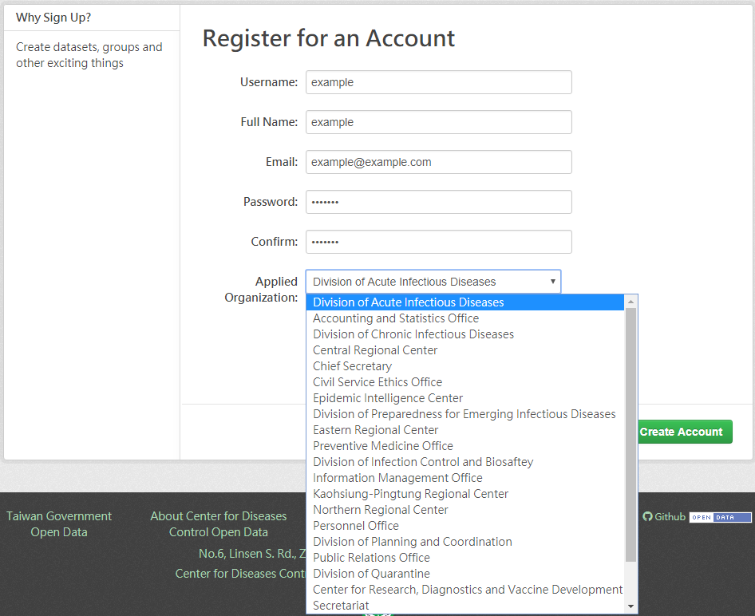
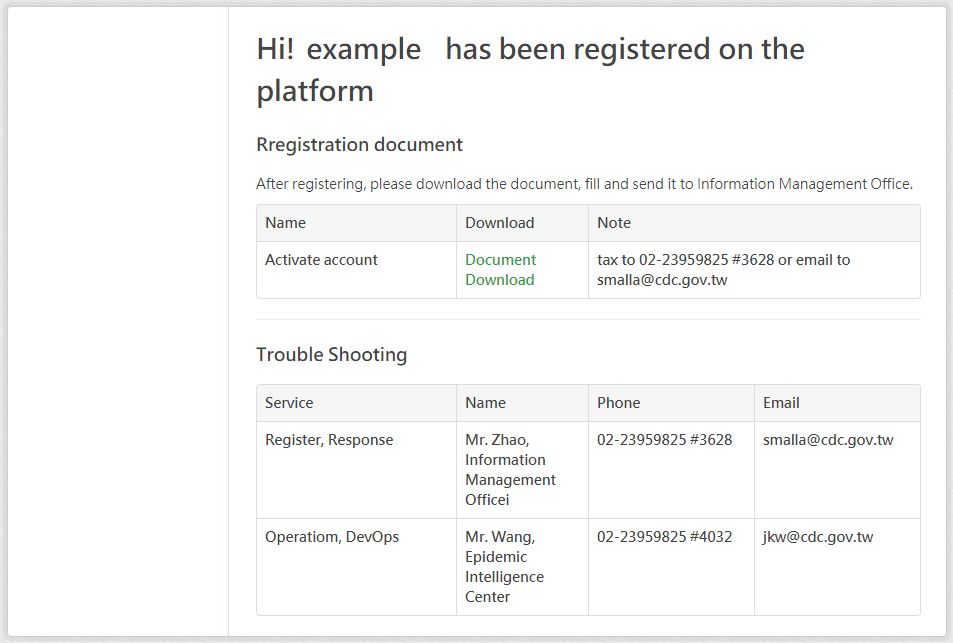
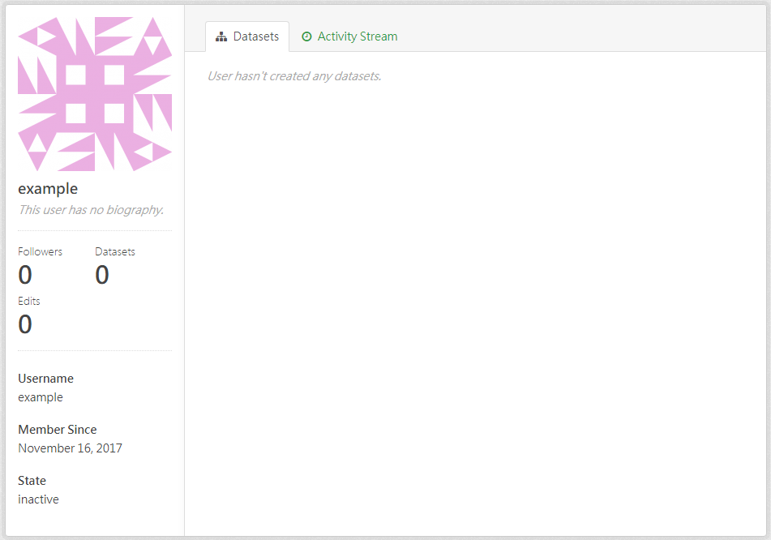
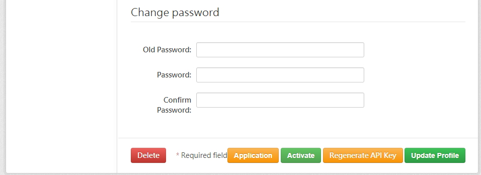
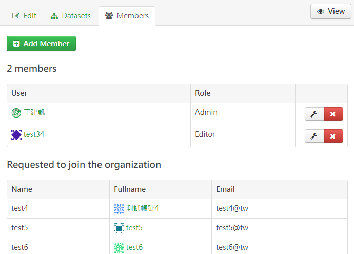

.. You should enable this project on travis-ci.org and coveralls.io to make
   these badges work. The necessary Travis and Coverage config files have been
   generated for you.

.. image:: https://travis-ci.org/jiankaiwang/ckanext-cdcregistration.svg?branch=master
    :target: https://travis-ci.org/jiankaiwang/ckanext-cdcregistration

=============
ckanext-cdcregistration
=============

Build a new register form for different sections.

* Add a item for selecting sections.

* Register a new account on the platform.

Construct a approval required registration plugin. The following are steps to demo the registration flow.

* Register completely and show the document link to print out for verification.

* The verification doucment for printing is created by javascript.

* Add activated status on the user webpage and the default is inactive.

* Activate the registered user.

Add a user into the organization.

* List all members requesting to join the organization.

* Add the user to the current organization is the same with the origin ckan.

------------
Requirements
------------

* Developed on CKAN 2.5.x

* Required package : `ckanext-cdcmainlib<https://github.com/jiankaiwang/ckanext-cdcmainlib>`_.

* Require library : `py2psql.py<https://github.com/jiankaiwang/seed/blob/master/python/py2psql.py>_`

-----------
Preparation
-----------

Modify the data table in the postgresql database in order to add new column for conserving new information.
The following are example commands::

     $ psql -U ckan_default

     # add new column into table user
     => ALTER TABLE "user" ADD COLUMN organ text;

     # check column is added
     \d+ public.user

     # set the whole users' organ to a existing one
     => update public.user set organ = 'eic' where id = '' or 1 = 1;
     
     # make sure all users' email are available
     => update public.user set email = 'example@example.com' where email = '';

Before installing ckanext-cdcregistration, several source codes need to be modified:

1. Activate your CKAN virtual environment, for example::

     . /usr/lib/ckan/default/bin/activate

2. Clone the ckanext-cdcregistration from github, for example::

     cd /usr/lib/ckan/default/src/

     git clone https://github.com/jiankaiwang/ckanext-cdcregistration.git

3. Edit the verification document for printing. The command for editing document::

     vim /usr/lib/ckan/default/src/ckanext-cdcregistration/ckanext/cdcregistration/fanstatic/register.js    

4. Modify the origin CKAN source code to prevent from auto-registration.
   The command is for creating a new account::

     vim /usr/lib/ckan/default/src/ckan/ckan/logic/action/create.py

   The edited source code as the following::

     # import necessary package
     from py2psql import *

     # on function user_create, after .commit() add new content for the user status
     # ....
     if not context.get('defer_commit'):
         model.repo.commit()

     # modify user state and add value into organ
     p2l = py2psql("ip","port","dbname","tbname","user","pass")
     p2l.update({"state":"inactive", "organ":data_dict["organ"]}, {"name":data_dict["name"], "email":data_dict["email"]})
     # ...

5. Modify the origin CKAN source code to redirect a new page after registration complete.
   The command is for updating the organization::

     vim /usr/lib/ckan/default/src/ckan/ckan/controllers/user.py

   The edited source code as the following::

     def _save_new(self, context):

        # ...

        if not c.user:
            # log the user in programatically
            rememberer = request.environ['repoze.who.plugins']['friendlyform']
            identity = {'repoze.who.userid': data_dict['name']}
            response.headerlist += rememberer.remember(request.environ,
                                                       identity)
            #h.redirect_to(controller='user', action='me', __ckan_no_root=True)

            # render to another page for further infomation
            return render('user/register_complete.html')

        # ...

6. Modify the origin CKAN source code to update the organization information.
   The command is for updating the organization::

     vim /usr/lib/ckan/default/src/ckan/ckan/logic/action/update.py

   The edited source code as the following::

     # import necessary package
     from py2psql import *

     # on function user_update, after .commit() update new content
     # ....
     if not context.get('defer_commit'):
         model.repo.commit()

     # modify user state and add value into organ
     p2l = py2psql("ip","port","dbname","tbname","user","pass")
     p2l.update({"organ":data_dict["organ"]}, {"name":data_dict["name"], "email":data_dict["email"]})
     # ...     

7. Modify the origin CKAN source code to fetch the organization information.
   The command is for updating the organization::

     vim /usr/lib/ckan/default/src/ckan/ckan/lib/dictization/model_dictize.py

   The edited source code as the following::

     # import necessary package
     from py2psql import *

     def user_dictize(user, context, include_password_hash=False):
         if context.get('with_capacity'):
             user, capacity = user
             result_dict = d.table_dictize(user, context, capacity=capacity)
         else:
             result_dict = d.table_dictize(user, context)

         password_hash = result_dict.pop('password')
         del result_dict['reset_key']

         result_dict['display_name'] = user.display_name
         result_dict['email_hash'] = user.email_hash
         result_dict['number_of_edits'] = user.number_of_edits()

         # customize to get organ value
         p2l = py2psql("ip","port","dbname","tbname","user","pass")
         result_dict.setdefault('organ', p2l.select({"email": user.email},["organ"],asdict=True)[0]["organ"])

         result_dict['number_created_packages'] = user.number_created_packages(
       ...

------------
Installation
------------

1. Install the ckanext-cdcregistration Python package into your virtual environment::

     cd /usr/lib/ckan/default/src/ckanext-cdcregistration

     pip install .

2. Add ``cdcregistration`` to the ``ckan.plugins`` setting in your CKAN
   config file (by default the config file is located at
   ``/etc/ckan/default/production.ini``).

3. Restart CKAN. For example if you've deployed CKAN with Apache on Ubuntu::

     sudo service apache2 reload

   If you've deployed CKAN with uwsgi::

     uwsgi --ini-paste /etc/ckan/default/production.ini

   If you've create a ckan.service::

     sudo systemctl restart ckan.service

------------------------
Development Installation
------------------------

To install ckanext-cdcregistration for development, activate your CKAN virtualenv and
do::

    git clone https://github.com/jiankaiwang/ckanext-cdcregistration.git
    cd ckanext-cdcregistration
    python setup.py develop
    pip install -r dev-requirements.txt

----------------------------------------
Releasing a New Version of ckanext-cdcregistration
----------------------------------------

1. Update the version number in the ``setup.py`` file.
   See `PEP 440 <http://legacy.python.org/dev/peps/pep-0440/#public-version-identifiers>`_
   for how to choose version numbers.

2. Create a source distribution of the new version::

     python setup.py sdist

3. Upload the source distribution to PyPI::

     python setup.py sdist upload

4. Tag the new release of the project on GitHub with the version number from
   the ``setup.py`` file. For example if the version number in ``setup.py`` is
   0.0.2 then do::

       git tag 0.0.2
       git push --tags
